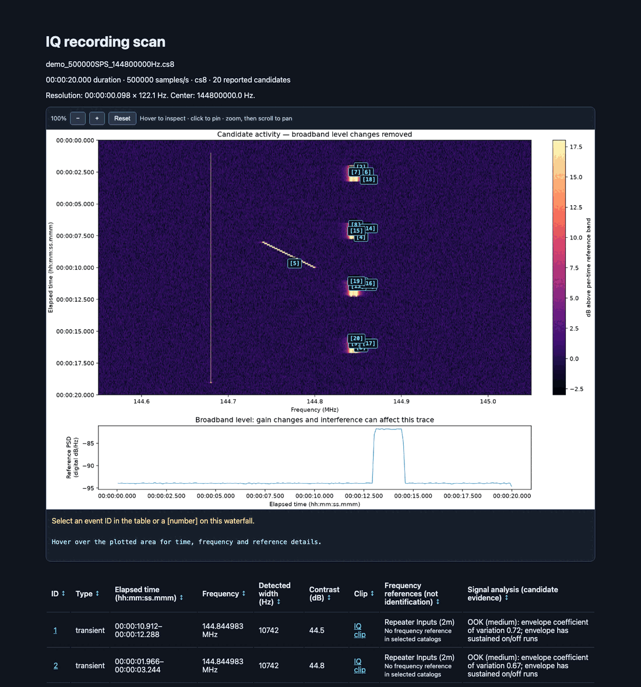
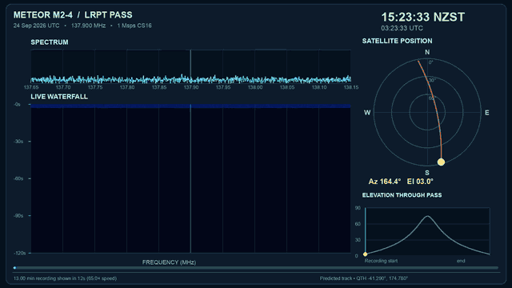

<div align="center">

```text
█████    ███     ████    ████    ███    █   █
  █     █   █   █       █       █   █   ██  █
  █     █   █   █       █       █   █   ██  █
  █     █   █    ███    █       █████   █ █ █
  █     █ █ █       █   █       █   █   █  ██
  █     █  █        █   █       █   █   █  ██
█████    ██ █   ████     ████   █   █   █   █
```

### Find the signals hiding in an IQ recording.

Point it at a raw capture. Get back an interactive offline report — waterfall,
ranked events, zoomed spectrograms, and bit-exact IQ clips ready for inspectrum.

<p>


</p>
<p>


<a href="LICENSE"></a>
<a href="https://github.com/gdamdam/iqscan/actions/workflows/tests.yml"></a>
</p>

</div>

---

### Station catalog

WWV/WWVH time-station and Meteor frequency references are built in and work
offline. Download or refresh the broader EiBi shortwave/utility catalog with:

```sh
iqscan --update-references
```

Then scan normally: saved stations are matched automatically, with no custom
JSON file. `--offline-references` uses local data only; `--known-signals eibi`
also fetches the schedule on a first scan. Failed updates keep the last usable
catalog. Matches are frequency hints, not confirmed station identities or
checks against broadcast times. EiBi data is for non-commercial use; see the
[reference guide](docs/guide.md#band-plans-and-known-signal-hints-downloaded-cached-matched-locally).


## ⚡ Quick start

```sh
git clone https://github.com/gdamdam/iqscan.git
cd iqscan
./scan.sh /path/to/capture.cs8 --sample-rate 500000 --center-frequency 137900000 --open
```

Replace the path, sample rate, and center frequency with your recording's values.
The launcher creates `.venv` and installs dependencies on first use. It saves a
report under `scans/` and opens it in your browser. Your recording is never modified.

On Windows use `scan.cmd` with the same arguments (it creates `.venv` and installs
the package on first use); inspectrum has no official Windows build, so open clips
with their `.sigmf-meta` in a SigMF-aware viewer such as IQEngine, or under WSL.

**Use the saved sample rate after decimation.** Metadata can also come from a
SigMF/WAV header (including the SDR#/HDSDR `auxi` center frequency) or a filename such as
`capture_500000SPS_137900000Hz.cs8` or `HDSDR_137900kHz_RF.wav`.

---

## 🖼 What you get

| Output | Purpose |
|---|---|
| `report.html` | Browse the waterfall, select events, and zoom into signals |
| `events.json` / `events.csv` | Inspect or process the detection results |
| `clips/` | Exact excerpts of the original recording |
| `OPEN-CLIPS.txt` | Commands to open clips in inspectrum |

Keep the report folder together; the HTML uses images and files beside it.

<p align="center">

<br><sub>Report for a synthetic 20 s, 500 kS/s recording with FSK bursts, a chirp, a steady carrier and a broadband burst.</sub>
</p>

---

## 🎛 Common tasks

Add these options to your scan command:

| Task | Options |
|---|---|
| Inspect possible modulation and supported protocols | `--analyze-signals` |
| Scan only part of a recording | `--start 30 --duration 15` |
| Keep a wideband signal out of the level reference | `--reference-band 0.05 0.15` |
| Export filtered, centered channels | `--channel-clips 3` |
| Add satellite frequency hints | `--sat` |
| Remove generated absolute paths for sharing | `--portable --clips 0` |
| Save a spectrum for later adjustments | `--save-spectrum` |

Decode Meteor M2-3 or M2-4 LRPT channel images and telemetry from a stopped
CS16 recording using SatDump's offline pipeline:

```sh
./scan.sh meteor /path/to/recording_2000000SPS_137500000Hz.cs16 \
  --satellite M2-4 --frequency 137900000 --video
```

The new result folder contains `images/`, SatDump's recovered data in `satdump/`,
`extraction.json`, the decoder log, and (with `--video`) a scrolling-waterfall
video and poster. The video uses nextpass's configured observer location and
cached orbital elements to **predict** the satellite track; it does not measure
pointing from the IQ. Both SatDump 1.x stable and 2.x CLI forms are supported.
`ffmpeg` is required for video. See [Meteor extraction](docs/guide.md#meteor-lrpt-image-extraction).

<p align="center">

<br><sub><b>Simulation:</b> the waterfall is synthetic; the sky track is a real M2-4 prediction for a neutral example location (Wellington, NZ).</sub>
</p>

To adjust an existing cached scan:

```sh
./scan.sh --redetect scans/YOUR_SCAN --threshold 9
./scan.sh --serve --open
```

The browser explorer previews changes. Run its printed command to save a new report.
See all options with `./scan.sh --help`.

---

## 🔎 Before interpreting or sharing results

- Detections are candidates. Interference and receiver artifacts can appear as signals.
- Frequency matches are hints; they do not identify a transmitter. Contrast is not calibrated SNR.
- Reports normally contain local paths and recording metadata. Even with `--portable`, review filenames and metadata before sharing.
- Band plans download automatically when the center frequency is known. Use `--offline-references` to prevent catalog downloads; IQ data stays local.

---

## 📚 Learn more

- [Formats and input metadata](docs/guide.md#what-goes-in)
- [Analysis, exports, and cached scans](docs/guide.md#everyday-commands)
- [Reference catalogs](docs/guide.md#band-plans-and-known-signal-hints-downloaded-cached-matched-locally)
- [Pip installation](docs/guide.md#quickstart) · [Tests](docs/guide.md#validation) · [Changelog](CHANGELOG.md)

Use [nextpass](https://github.com/gdamdam/nextpass) to plan a satellite recording.
